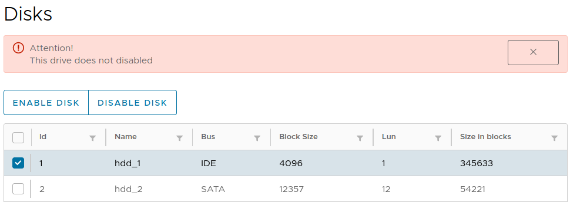

# Angular + Clarity project
### This is a single page application
### about disk table
#### The user can perform the following operations on disks:
##### - Drive connection
##### - Disconnect disk
###### User can connect or disconnect only one drive currently selected from list
###### The user must confirm the selected operation
###### Should be notification with information about the current operation
###### User cannot enable / disable disk if disk already in this state
###### It is necessary to notify the client about the impossibility of this operation
###### After the complete shutdown operation, all information on this disk displayed in the list of drives in gray

###### Table with disks info
---

###### Selected row
---

###### Error message when select no one row
---

###### Error message when select two and more row
---

###### Error message when the selected row does not disabled 
---

###### Info message
---

###### Disable row
---

###### Enable row
---

